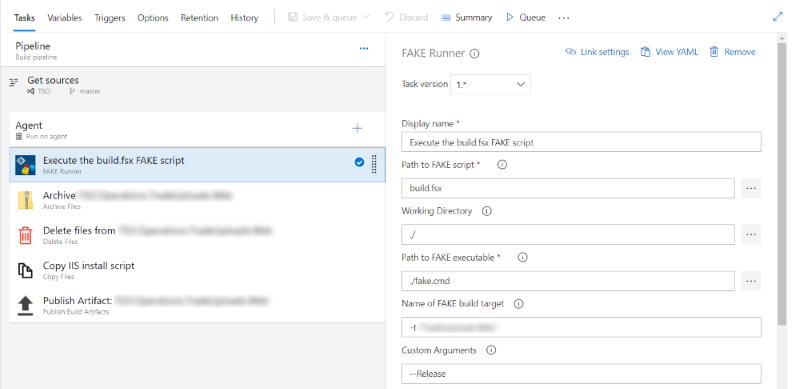

- title : FAKE It Until You Make It
- description : FAKE It Until You Make It. Denver Dev Day (May 31, 2019)
- author : Grigoriy Belenkiy
- theme : simple
- transition : convex

***
- data-background : ./images/sponsors-slide.png
- data-background-transition : none

' Sponsors slide (required by organizators)

***

### FAKE It Until You Make It


<small>Grigoriy Belenkiy<br/>
Software engineer at 
<br/>
<a href="https://twitter.com/@grishace/">@grishace</a>
<br/>
<br/>
Denver Dev Day<br/>
May 31, 2019</small>

***

### DevOps

* What if you're more on the Dev side than on Ops?
* No dedicated team?
* Want to give F# a try?

***

### FAKE = F# Make

* Code your build with a gazillion helper functions
* Not limited to the build - can run FSX script
* Global dotnet tool

' #! on Linux?

***

### Extras

* Paket = Nuget + scripts (from the GitHub for example)
* Download and add references

***

### Demo

Hello, World!

***

### Anatomy of the build script

* Paket - build group reference
* Evaluate environment variables (if needed)
* Targets (i.e. build steps)
* Target dependencies
* Default target

***

### Demo

Hello, World! (again)

***

### Bonus - Azure pipeline task

*


---

### Bonus - ARM Helper

<small>
```
github CompositionalIT/fshelpers src/FsHelpers/ArmHelper/ArmHelper.fs
...
#load "paket-files/build/CompositionalIT/fshelpers/src/FsHelpers/
       ArmHelper/ArmHelper.fs"
```
</small>

***

#### Questions?

[](https://github.com/grishace/ddd-fake)<br/>
[https://github.com/grishace/ddd-fake](https://github.com/grishace/ddd-fake)

[https://fake.build](https://fake.build/)
